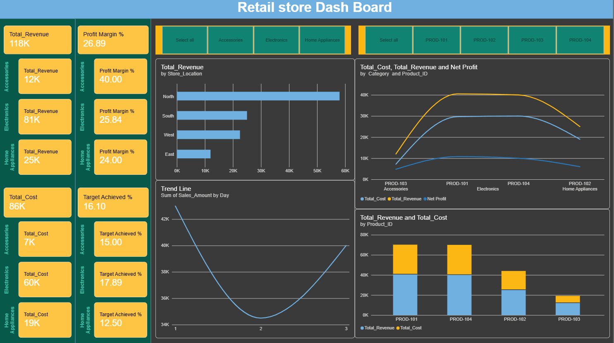
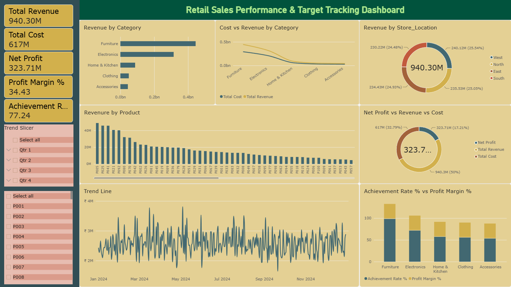

# Retail Sales Performance & Target Tracking Dashboard

## Project Overview

This Power BI project focuses on analyzing retail sales performance, profitability, regional performance, product-level trends, and target achievement across multiple product categories. The dashboard was built using a multi-table data model containing sales transactions, product information, targets, and regional manager mapping.

The objective of this project is to provide business stakeholders with a centralized view of revenue, cost, profit, sales trends, category performance, and target achievement while also demonstrating Row-Level Security (RLS) implementation for regional managers.

---

## Dashboard Preview

### Initial Prototype / Draft


### Final Dashboard


---

## Dataset Information

### Sales Transactions (50,000+ Rows)
- Transaction_ID
- Date
- Store_Location
- Product_ID
- Quantity
- Sales_Amount

### Products & Targets
- Product_ID
- Category
- Cost_Price
- Monthly_Target

### Manager Mapping
- Store_Location
- Regional_Manager_Email

---

## Key KPIs

| KPI | Value |
|------|---------|
| Total Revenue | ₹940.30M |
| Total Cost | ₹617M |
| Net Profit | ₹323.71M |
| Profit Margin | 34.43% |
| Target Achievement Rate | 83.10% |

---

## Features Implemented

### Data Modeling
- Created relationships across multiple tables.
- Built a star-schema style model for analysis.
- Connected sales, products, targets, and manager mapping tables.

### DAX Measures
Created custom measures for:
- Total Revenue
- Total Cost
- Net Profit
- Profit Margin %
- Achievement Rate %

### Interactive Dashboard
Implemented:
- Product Filters
- Category Filters
- Quarter Slicers
- Dynamic KPI Cards
- Trend Analysis
- Category Performance Analysis
- Product Performance Analysis
- Regional Revenue Analysis

### Row-Level Security (RLS)
Implemented dynamic Row-Level Security using:

```DAX
Manager_Mapping_Table[Regional_Manager_Email]
    = USERPRINCIPALNAME()
```

This allows regional managers to view only their assigned region's data.

#### RLS Configuration


#### RLS Testing Example


---

## Business Insights

### Category Performance
- Furniture is the highest revenue-generating category.
- Electronics is the second strongest category.
- Furniture and Electronics are the most profitable categories overall.

### Regional Performance
- The West region generates the highest revenue among all regions.
- Revenue distribution remains relatively balanced across regions, with West leading overall performance.

### Product Performance
Top 5 Revenue Generating Products:
1. P005
2. P025
3. P041
4. P021
5. P092

Lowest Performing Products:
1. P011
2. P084
3. P096
4. P064
5. P075

### Sales Trends
- Most sales occur during the first half of the year.
- Quarter 1 and Quarter 2 contribute the highest revenue.
- Top-performing products maintain strong performance throughout the year.

### Profitability
- Net Profit reached ₹323.71M.
- Overall Profit Margin is 34.43%.
- The business achieved 83.10% of its target performance.

---

## Skills Demonstrated

### Power BI
- Data Modeling
- Relationship Management
- DAX Calculations
- KPI Design
- Dashboard Development
- Interactive Reporting
- Data Visualization
- Slicers & Filtering

### Business Analytics
- Sales Analysis
- Profitability Analysis
- Product Performance Tracking
- Regional Performance Monitoring
- Target Achievement Tracking

### Security
- Dynamic Row-Level Security (RLS)
- Role Testing & Validation

---

## Tools Used

- Power BI Desktop
- Power Query
- DAX
- Data Modeling
- Row-Level Security (RLS)

---

## Project Outcome

This dashboard provides a centralized reporting solution for monitoring retail sales performance, profitability, target achievement, regional performance, and product trends. The implementation of Row-Level Security ensures that managers can securely access only the data relevant to their assigned region.
